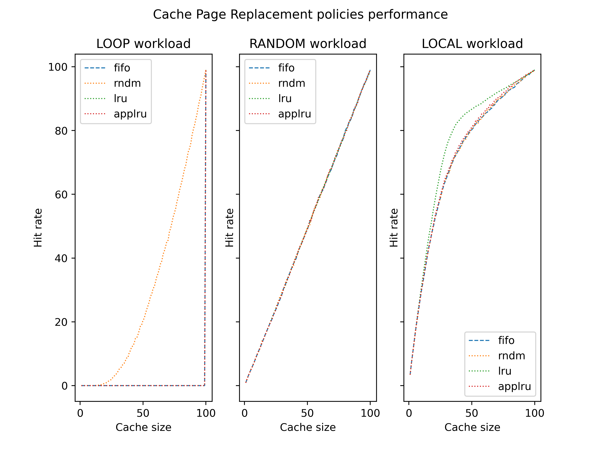
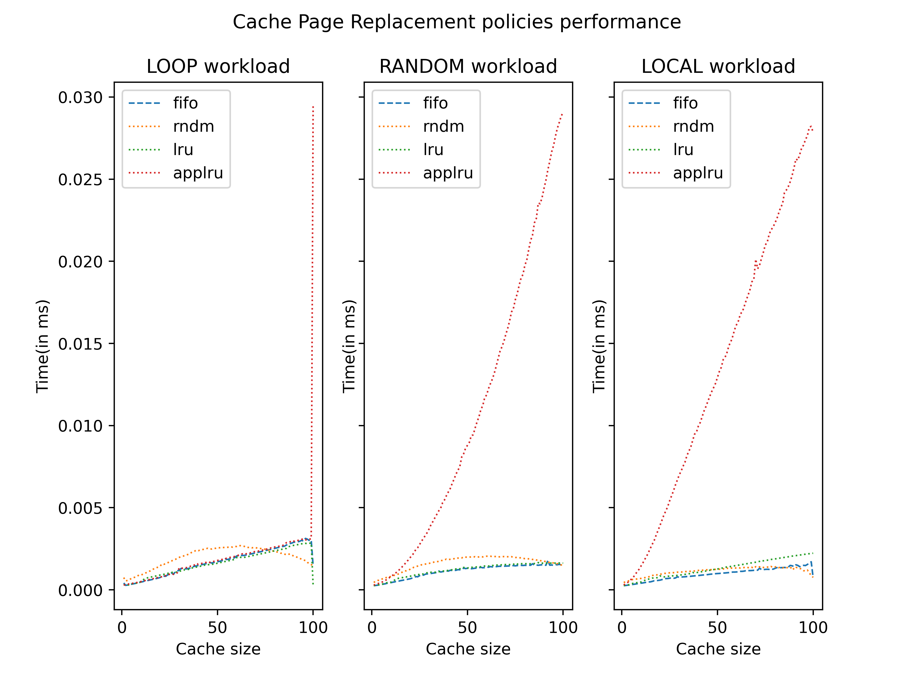

# Types of Workloads
 - ### LOOP: 
        Pages repeating from 0-49 over the whole workload.
 - ### RANDOM
        Pages randomly appearing from 0-49 over the whole workload
 - ### LOCAL
        Randomly selecting a page where,
        80% probability that it would be from first 20% and
        20% probability that it would be from first 80% and

# Cache Replacement Policies
 - ### FIFO
        Pages are simple placed on the back of the queue. When cache becomes full, the last page is removed.
         - Implemented using a queue
         - Find()  : O(n)
         - Remove(): O(1)
 - ### RANDOM
        Pages are simply placed on the back of the queue. When cache becomes full, a random page from the queue is removed.
         - Implemented using a queue
         - Find()  : O(n)
         - Remove(): O(n)
 - ### LRU
        Pages are placed on the back of the queue, when some page is accessed, it is kept in front.
        When cache becomes full, the last page(least recently used) is removed from the queue.
         - Implemented using a queue
         - Find()  : O(n)
         - Remove(): O(1)
 - ### approx LRU
        Pages are placed into the queue when cache is not full. 
        When cache is full, we look up into our circular bitref 
        and find the first element with bitref as 0(and if we encounter 1, we set it to 0). 
        We remove that element, and push our element into the queue.
         - Implemented using a queue and a bitref(int array)
         - Find()  : O(n)
         - Remove(): O(n)

# Hit Rate graph

# Timing Analysis

