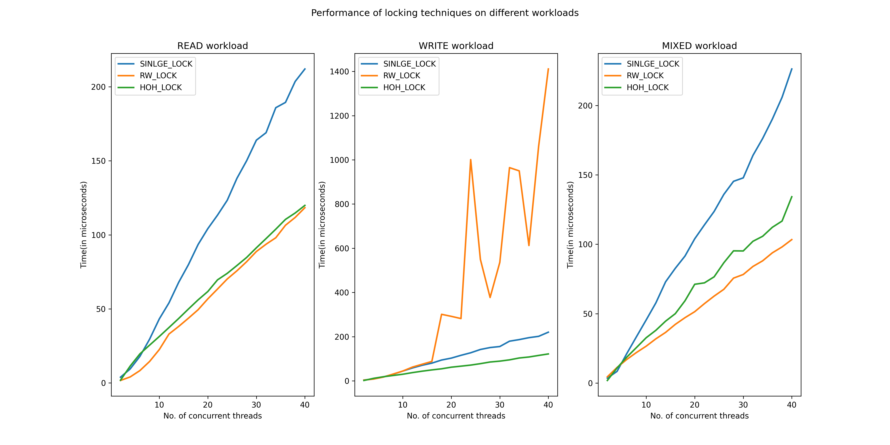

<!--  -->
# Assignment2
## Q1: Developing a trie data structure
### Performance of different locking mechanisms on different workloads

## Q2: Implementing caching policies
### Hit Rate graph

### Timing Analysis

## Files
<pre>├── <b>Q1</b>
│   ├── graph.py
│   ├── Makefile
│   ├── OUTPUT.txt
│   ├── <b>plots</b>
│   │   └── <b>graph.png</b>
│   ├── plots.md
│   ├── README.md
│   ├── <b>tests</b>
│   │   ├── <b>multi_thread</b>
│   │   │   ├── <b>find</b>
│   │   │   │   ├── 1.txt
│   │   │   │   ├── 2.txt
│   │   │   │   ├── 3.txt
│   │   │   │   ├── exp_find_1.txt
│   │   │   │   ├── exp_find_2.txt
│   │   │   │   └── exp_find_3.txt
│   │   │   ├── <b>initial</b>
│   │   │   │   ├── 1.txt
│   │   │   │   ├── 2.txt
│   │   │   │   ├── 3.txt
│   │   │   │   └── exp_ins.txt
│   │   │   ├── <b>pref</b>
│   │   │   │   ├── 1.txt
│   │   │   │   ├── 2.txt
│   │   │   │   ├── 3.txt
│   │   │   │   ├── exp_1.txt
│   │   │   │   ├── exp_2.txt
│   │   │   │   └── exp_3.txt
│   │   │   └── <b>rem</b>
│   │   │       ├── 1.txt
│   │   │       ├── 2.txt
│   │   │       ├── 3.txt
│   │   │       └── exp.txt
│   │   └── <b>single_thread</b>
│   │       ├── exp_ins.txt
│   │       ├── exp_rem.txt
│   │       ├── find_test_exp.txt
│   │       ├── find_test.txt
│   │       ├── initial.txt
│   │       ├── pref_text_exp.txt
│   │       ├── pref_text.txt
│   │       └── rem_list.txt
│   ├── test_trie_single_threaded.c
│   ├── test_trie_s_lock.c
│   ├── trie.c
│   ├── trie.h
│   ├── wl_hoh_lock.c
│   ├── wl_rw_lock.c
│   ├── wl_s_lock.c
│   ├── words.txt
│   └── workload.c
├── <b>Q2</b>
│   ├── definitions.h
│   ├── hr_graph.py
│   ├── main.c
│   ├── Makefile
│   ├── perf_graph.py
│   ├── <b>plots</b>
│   │   ├── <b>hr_graph.png</b>
│   │   └── <b>tm_graph.png</b>
│   ├── policy.c
│   ├── queue.c
│   ├── README.md
│   ├── Solutions.md
│   └── workload.c
└── README.md
</pre>

## How to run?
> Read the Makefile in both of the folders